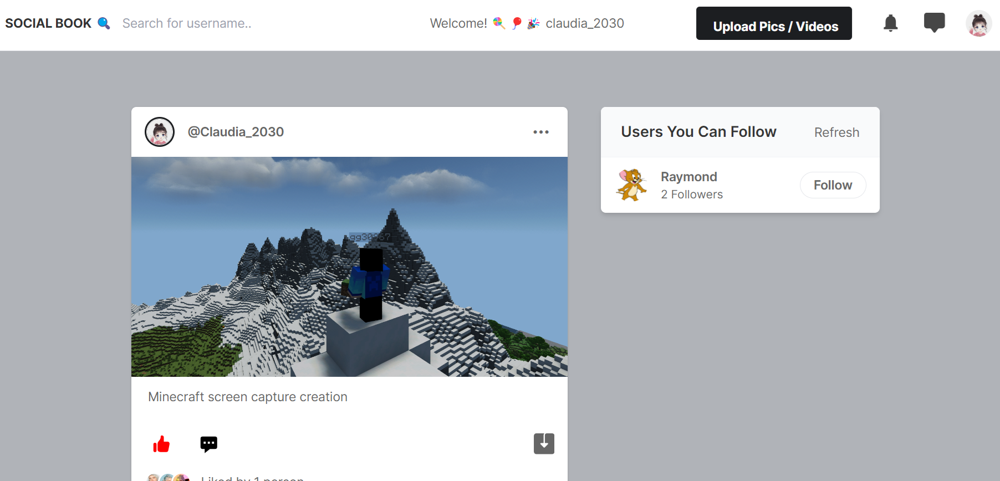
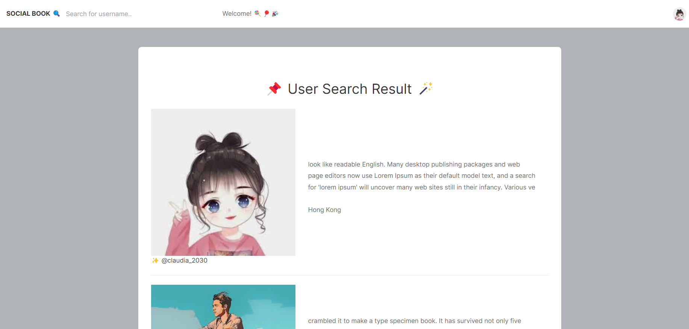

# Social Work Project
This project refers to the YouTube tutorial: https://www.youtube.com/watch?v=xSUm6iMtREA

## Updated Points from the Tutorial

### 1. Add api app  
The front end could visit the api endpoints. How to use Django to create Rest API could refer to this tutorial from Dennis Ivy for more details on implementation https://youtu.be/hISSGMafzvU.

I use Django Rest API to update the color of Like icon. Since django is by nature synchronous, whenever you want to send/fetch data from the server, the web page will reload. However, we do not want to get the page reload just because of clicking Like button. So, we need to use asynchronous technologies like AJAX. One way to accomplish this with Django is by building a restful API. The explanation for this concept could refer to this post: https://stackoverflow.com/questions/68475595/perform-action-from-a-form-or-link-without-refreshing-the-page-view-with-django

static/assets/js/app.js contains the code to call the Rest API. Please note that when you want to get the user info, this API function has to carry `@permission_classes([IsAuthenticated])` decorator. In fetch function of Javascript, you need to add `Authorization` field in headers section.
There are other Rest API endpoints, but they are not used yet at this moment.

*Note*: 
In order to get user token, you need to visit http://127.0.0.1:8000/api/users/token page to get a valid token. Put the token into the fetch function defined in static/assets/js/app.js to authorize the user.

### 2. Update some functions defined in core/views.py  
The core/views.py/index function in YouTube tutorial is not designed concisely. Using some Django filter arguments could simplify this process.

### 3. Add missing search.html template  
Show the search result in the html page. The header section follows the overall design style.

## To do
1. Add comment on others' post  
2. Post setting (delete post, disallow comment, edit post, etc.)
3. Some styles (including css, js, font, etc.) from static folder are provided as they are, and they are not used.

